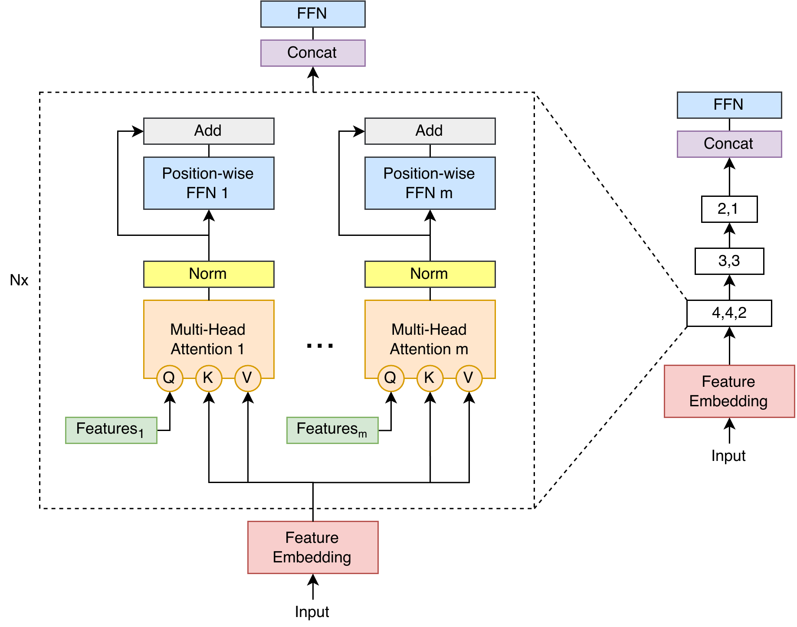

# Transformer-for-High-Dimensional-Tabular-Data---MSTT

MSTT (Multi-module Sparse Token Transformer) is a Transformer-based architecture designed for tabular classification,
with a particular focus on high-dimensional datasets.

This repository provides the MSTT implementation, an introductory tutorial,
and the experimental scripts used to evaluate the proposed architecture.

## Overview

Transformer-based models have shown promising results for tabular
classification. However, conventional self-attention mechanisms can
introduce substantial computational and memory requirements when
applied to high-dimensional datasets.

To address these challenges, we propose the Multi-module Sparse Token
Transformer (MSTT), an efficient Transformer architecture built on the
inductive bias that only a sparse, instance-dependent subset of the
$N$ input features is relevant for any given prediction.

MSTT replaces self-attention with cross-attention between a small set
of $k$ learned latent queries and the input features, reducing attention
complexity from $O(N^2)$ to $O(kN)$ and enabling dynamic, instance-dependent
feature selection.

Multiple attention modules operate in parallel, and their outputs are
fused through attention-based pooling before being passed to an MLP
classification head.

## Architecture

<p align="center">
  
</p>

MSTT consists of four main components:

1. **Feature Embedding:** Numerical and categorical features are transformed
   into embedding representations using the feature tokenization approach
   introduced in FT-Transformer.

2. **Multi-Module Attention:** Parallel cross-attention modules use learnable
   feature queries to extract information from the input representations.
   Each module can employ a different number of learned queries, allowing
   the architecture to construct representations with different numbers
   of tokens.

   The outputs of the parallel modules are concatenated and used as the
   input to the next attention layer. This hierarchical process enables
   MSTT to progressively refine and reduce the number of feature
   representations across successive layers.

3. **Feature Aggregation:** The output representations produced by the
   final attention layer are aggregated into a single vector through
   attention-based pooling.

4. **Classification Head:** The aggregated representation is passed
   through a multilayer perceptron (MLP) to generate the final
   classification predictions.

MSTT supports binary and multiclass classification and can be configured
with different numbers of attention layers, parallel modules, and
learnable feature queries.

## Repository Structure

```text
Transformer-for-High-Dimensional-Tabular-Data---MSTT/
│
├── src/
│   ├── model.py
│   ├── training.py
│   ├── testing.py
│   ├── utils.py
│   └── preprocess_data.py
│
├── notebooks/
│   ├── MSTT_tutorial_for_external_dataset.ipynb
│   └── MSTT_tutorial_openml_dataset.ipynb
│
├── experiments/
│   ├── README.md
│   └── tabzilla/
│       ├── run_experiment_mstt.py
│       ├── preprocess_data_tab.py
│       ├── tabzilla_dataset.py
│       ├── configs/
│       │   ├── config.yaml
│       │   └── hyperparameters.yaml
│       │
│       ├── example_dataset/
│       └── results/
├── figures/
│
├── requirements.txt
└── README.md
```

The `src/` directory contains the core MSTT implementation and supporting utilities.

The `notebooks/` directory provides an introductory tutorial demonstrating how to use MSTT for tabular classification.

The `experiments/` directory contains the scripts used for the experimental evaluation of MSTT, along with a sample dataset, configuration files, and example results to illustrate the experimental workflow.

The provided configuration files are intended to demonstrate how to run the experiments and do not represent the complete hyperparameter configurations used in the paper.

## Installation

### 1. Clone the repository

```bash
git clone https://github.com/KarinaTC/Transformer-for-High-Dimensional-Tabular-Data---MSTT
cd MSTT
```

### 2. Create a virtual environment

Python 3.10 is recommended.

```bash
python3.10 -m venv mstt_venv
```

Activate the environment:

**Linux/macOS:**

```bash
source mstt_venv/bin/activate
```

**Windows:**

```bash
mstt_venv\Scripts\activate
```

### 3. Install the dependencies

```bash
pip install --upgrade pip
pip install -r requirements.txt
```

For GPU acceleration, ensure that your PyTorch installation is compatible with your CUDA environment.

## Getting Started

To get started with MSTT, we recommend following the introductory notebook:

`notebooks/MSTT_tutorial_openml_dataset.ipynb`

The tutorial demonstrates how to:

- Load and preprocess an OpenML dataset.
- Organize numerical and categorical features.
- Create PyTorch Datasets and DataLoaders.
- Configure and initialize MSTT.
- Define the loss function and optimizer.
- Train and evaluate the model.

The preprocessing utilities provided in the tutorial are intended to simplify experimentation with OpenML datasets.

MSTT itself is not restricted to OpenML and can be used with other tabular data sources.

## Reproducing the Experiments


For detailed information about dataset preparation, required files, experimental configurations, and execution instructions, please refer to:

[Experiments README](experiments/README.md)
